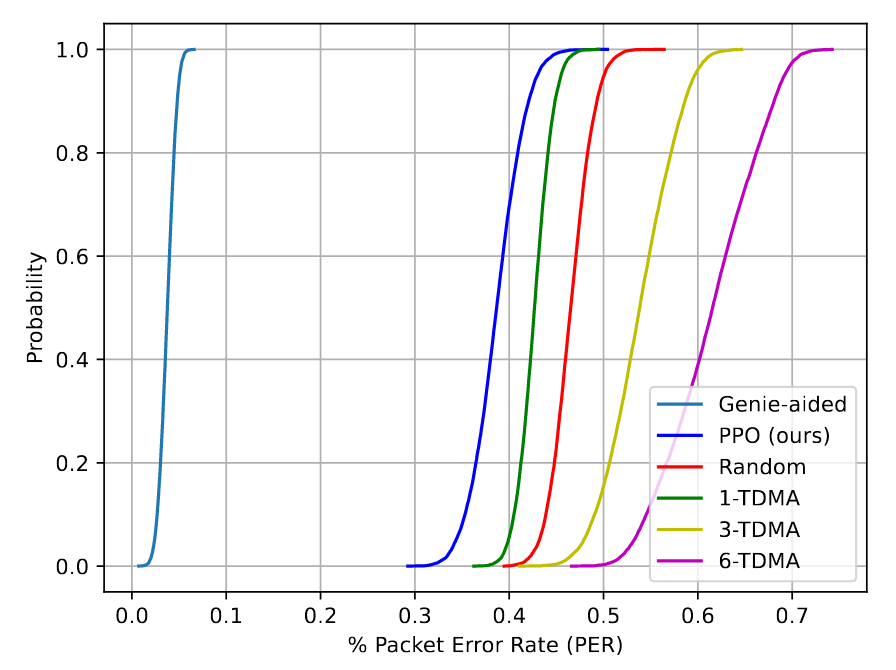
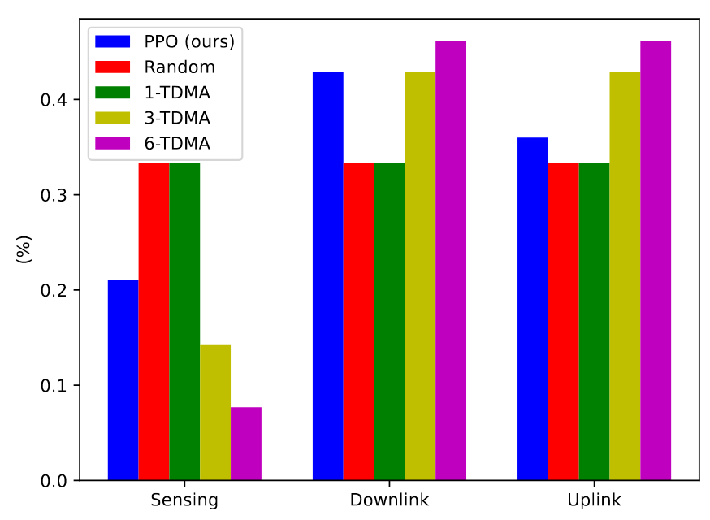
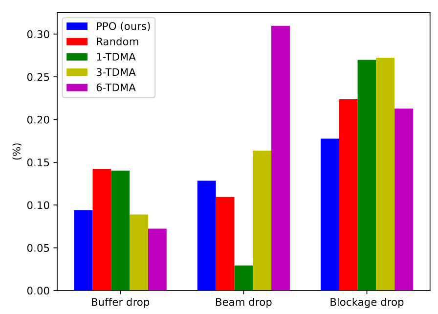

## Introduction​
This repo contains the source code for the paper *Proximal Policy Optimization for Integrated Sensing and Communication in mmWave Systems*.
It uses PPO algorithm for optimizing the resource management in a multi-user V2X network.

​

## Description (Simulation Environment and AI Algorithm)​
**Dependencies:**
* Python 3.8-3.11
* Torch
* Gymnasium
* Numpy


**Code Description:**

1. beam_management_env_letter.py 
This wrapper clarifies the ISAC environment. The preset parameter values are shown in the Table. *make()*, *reset()*, *step()* and *render()* are modified associated with the mobile vehicular network.

2. PPO.py  
This wrapper contains the main class for the PPO algorithm. 
actor_critic class defines the actor and critic neural networks. 
PPO class clarifies functions that are needed for PPO algorithm, such as, sample_action, evaluate, and save trajectory to the buffer. 

3. Train_PPO.py
This wrapper takes PPO agent and environment as input and train the PPO agent's actor_critic network. The training results are written into /PPO_Logs/ folder.

**PPO algorithm**
PPO algorithm is an actor-critic algorithm. It does not rely on Markov assumption and the knowledge of the whole state. 

Compared to the actor 2 critic (A2C) algorithm, PPO does not have a high variance because it limits the size of each update through optimizing a surrogate objective function. 
<!-- The surrogate objective function is
$$
L^{CLIP}(\theta) = \mathrm{E}_t\left[ \min \big(r_t(\theta) \hat{A}_t, \text{clip} (r_t(\theta), 1-\epsilon, 1+\epsilon)\hat{A}_t \big)\right]
$$
where $r_t(\theta) = \frac{\pi_{\theta}(a_t|s_t)}{\pi_{\theta_{old}}(a_t|s_t)}$ is the ratio between the old and the new policies, $\epsilon$ is a hyperparameter which is used to guarantee that the policy has a big difference when updating the policy for the same batch of data. The policy is updated by
$$
\theta_{t+1} = \arg\max_{\theta} L^{CLIP}(\theta)
$$ 

In the equation, $\hat{A}_t$ is the estimate of the advantage function. The advantage function indicates how good the state is for the agent to be in. It is calculated based on the current value function $V_{\phi}(s_t)$, which is written as
$$
\hat{A}(t) = \sum_{i=t}^{N} \gamma^i r_i - V_{\phi}(s_t)
$$  
where $\gamma$ is the discount factor that balances the immediate and future reward.

The value function estimates the expected cumulative reward from the current state $s_t$ onwards. It is fit by regression on the mean square error
$$
\phi = \arg\max_{\phi} |V_{\phi}(s_t) - (r_t + \gamma V_{\phi}(s_{t+1}))|^2
$$
-->

## Potential Applications​
The repo provides a framework of resource management, such as, time, frequency, beam and power, for a multi-user MISO scenario.  
​

## Example Usage​

In a mmWave ISAC vehicular network, a multi-antenna BS serves multiple moving single-antenna vehicles. 
The BS allocates the time slots of sensing, uplink or downlink to the most suitable user considering data buffer status and users' beam in order to minimize the long term packet error rate. As shown from the paper, by using the PPO framework, the packet loss probability is decreased compared to random allocation or X-TDMA.

**Simulation Environment**
| Parameter |Symbol | Value | 
|---|---|---|
| BS antennas |$𝑀_𝑡$| 32 |
|Frequency |$𝑓_𝑐$| 28 GHz |
|Tx Power |$𝑃_𝑡$| 5 W |
|Signal-to-Noise Ratio |SNR| 20 dB |
|Scenario dimensions |SD| [100 x 100]|
| Number of UEs |$U$| 3 |
|Packet arrival probability |$𝑃_𝑢$| [0.6, 0.4, 0.3]|
| Packet dl/ul probability |$[𝑝^𝑢_{𝐷𝐿}, 𝑝^𝑢_{𝑈𝐿}]$| [0.5, 0.5] |
|NLoS situation probability |$𝑃^𝑢_{𝑁𝐿𝑜𝑆}| 0.3 |
|NLoS max duration |$𝑘_{𝑁𝐿𝑜𝑆}$| 6 |
|Shadowing gain drop |$𝜐_𝑢$| 0.0032 |
|UEs initial positions [(x, y) permute] |$[[𝑥^𝑢_0, 𝑦^𝑢_0]]$ | $[[0, 80], [0, 40], [0, 27]]$|
| Size of downlink buffers |$𝐵^𝑢_{𝐷𝐿}$| 100 |
|Size of uplink buffers |$𝐵^𝑢_{𝑈𝐿}$| 100 |
|Number of time slots |$𝐾$| 1000 |
|Number of training episodes |$𝐸_{train}$| 3000000 |
|Number of testing episodes |$𝐸_{test}$| 10000|


**Results**

  

<!--## Any other suggestions. --> ​

### Citation
```bibtex
@misc{vacarubio2023ppo4isacmmWave,
      title={Proximal Policy Optimization for Integrated Sensing and Communication in mmWave Systems}, 
      author={Cristian J. Vaca-Rubio and Carles Navarro Manchón and Ramoni Adeogun and Petar Popovski},
      year={2023},
      eprint={2306.15429},
      primaryClass={eess.SP},
      url={https://arxiv.org/abs/2306.15429}, 
}
```
